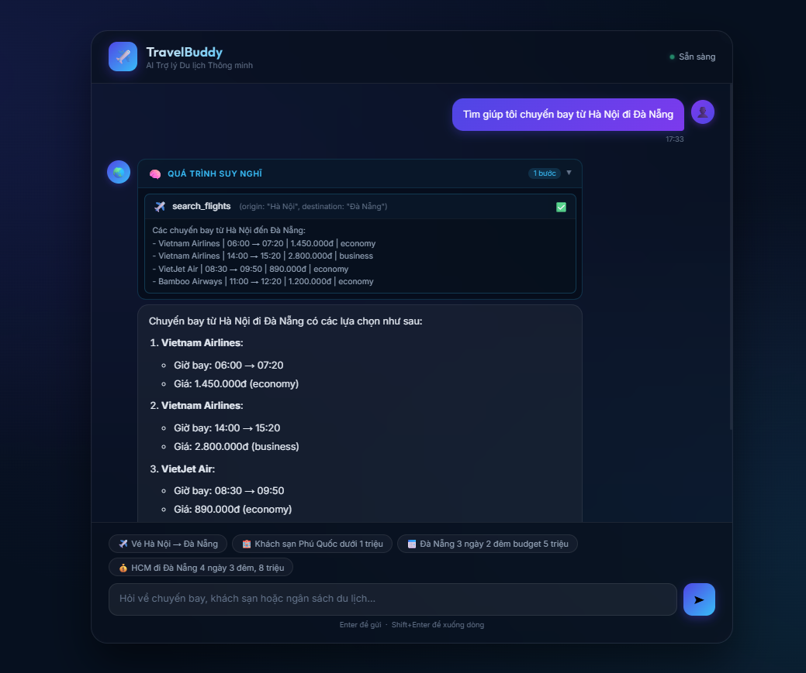

# Test Results - Lab 4

Test này là em test trên giao diện terminal, sau đấy khi đã hoạt động ổn rồi, em đã build UI cho nó, và test lại trên giao diện UI, kết quả có đôi chút khác nhưng về cơ bản, nó vẫn như vậy.
---

## Test 1 — Direct Answer

**Input:**
Xin chào! Tôi đang muốn đi du lịch nhưng chưa biết đi đâu.

**Output:**
TravelBuddy: Xin chào! Rất vui khi được hỗ trợ bạn trong kế hoạch du lịch. Bạn đã có ý tưởng về điểm đến nào chưa? Nếu chưa, tôi có thể gợi ý cho bạn vài địa điểm nổi tiếng ở Việt Nam như Hà Nội, Đà Nẵng, Hội An, Nha Trang hay Phú Quốc.

Ngoài ra, bạn có thể cho tôi biết thêm về ngân sách, số ngày dự định đi du lịch để mình tìm kiếm các lựa chọn phù hợp nhé!

---

## Test 2 — Single Tool Call

**Input:**
Tìm giúp tôi chuyến bay từ Hà Nội đi Đà Nẵng

**Output:**
TravelBuddy đang suy nghĩ...
Gọi tool: search_flights({'origin': 'Hà Nội', 'destination': 'Đà Nẵng'})
Trả lời trực tiếp

TravelBuddy: Chuyến bay từ Hà Nội đi Đà Nẵng có các lựa chọn sau:

1. **Vietnam Airlines**:
   - Giờ bay: 06:00 → 07:20
   - Giá: 1.450.000đ
   - Hạng vé: Economy

2. **Vietnam Airlines**:
   - Giờ bay: 14:00 → 15:20
   - Giá: 2.800.000đ
   - Hạng vé: Business

3. **VietJet Air**:
   - Giờ bay: 08:30 → 09:50
   - Giá: 890.000đ
   - Hạng vé: Economy

4. **Bamboo Airways**:
   - Giờ bay: 11:00 → 12:20
   - Giá: 1.200.000đ
   - Hạng vé: Economy

Nếu bạn muốn tiếp tục tìm khách sạn ở Đà Nẵng, hãy cho mình biết ngân sách của bạn nhé!

---

## Test 3 — Multi-step Tool Chaining

**Input:**
Tôi ở Hà Nội, muốn đi Đà Nẵng 2 đêm, budget 5 triệu. Tư vấn giúp tôi!

**Output:**
TravelBuddy đang suy nghĩ...
Gọi tool: search_flights({'origin': 'Hà Nội', 'destination': 'Đà Nẵng'})
Gọi tool: search_hotels({'city': 'Đà Nẵng', 'max_price_per_night': 1350000})
Gọi tool: calculate_budget(total_budget: 5000000, expenses: "vé_máy_bay:890000,khách_sạn:1300000", nights: 2)
Trả lời trực tiếp

TravelBuddy: Dưới đây là thông tin chuyến đi của bạn từ Hà Nội đến Đà Nẵng:

**Chuyến bay:**
- Vietnam Airlines | 06:00 → 07:20 | 1.450.000đ | economy

**Khách sạn:**
- Christina's Homestay | 2⭐ | 350.000đ/đêm | An Thượng | rating 4.7
- Thời gian ở lại: 2 đêm
- Tổng chi phí khách sạn: 700.000đ

**Tổng chi phí ước tính:**
- Vé máy bay: 1.450.000đ
- Khách sạn: 700.000đ
- **Tổng cộng: 2.150.000đ**
- Ngân sách còn lại: 2.850.000đ

**Gợi ý thêm:**
Bạn còn dư khá nhiều ngân sách, có thể dành cho việc mua sắm, ăn uống hoặc tham quan tại Đà Nẵng. Nếu cần thêm thông tin về các hoạt động ở Đà Nẵng hoặc đặt vé máy bay và khách sạn cụ thể, hãy cho mình biết!

---

## Test 4 — Missing Info

**Input:**
Tôi muốn đặt khách sạn

**Output:**
TravelBuddy đang suy nghĩ...
Trả lời trực tiếp

TravelBuddy: Để mình giúp bạn đặt khách sạn, bạn có thể cho mình biết một số thông tin sau không?

1. Điểm đến (thành phố hoặc khu vực cụ thể).
2. Thời gian bạn muốn đặt (ngày đến và ngày về).
3. Ngân sách cho mỗi đêm (nếu có).

Cảm ơn bạn!

---

## Test 5 — Refusal

**Input:**
Giải giúp tôi bài tập lập trình Python về list và tuple

**Output:**
TravelBuddy đang suy nghĩ...
Trả lời trực tiếp

TravelBuddy: Xin lỗi, nhưng mình chỉ có thể hỗ trợ về các yêu cầu liên quan đến du lịch. Nếu bạn có bất kỳ câu hỏi nào về chuyến bay, khách sạn, hoặc lập kế hoạch cho chuyến đi của mình, mình rất sẵn lòng giúp đỡ!

